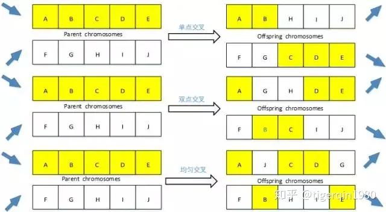
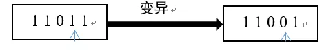
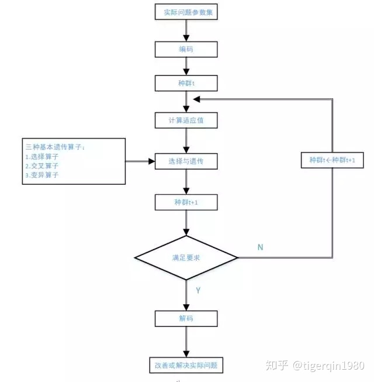
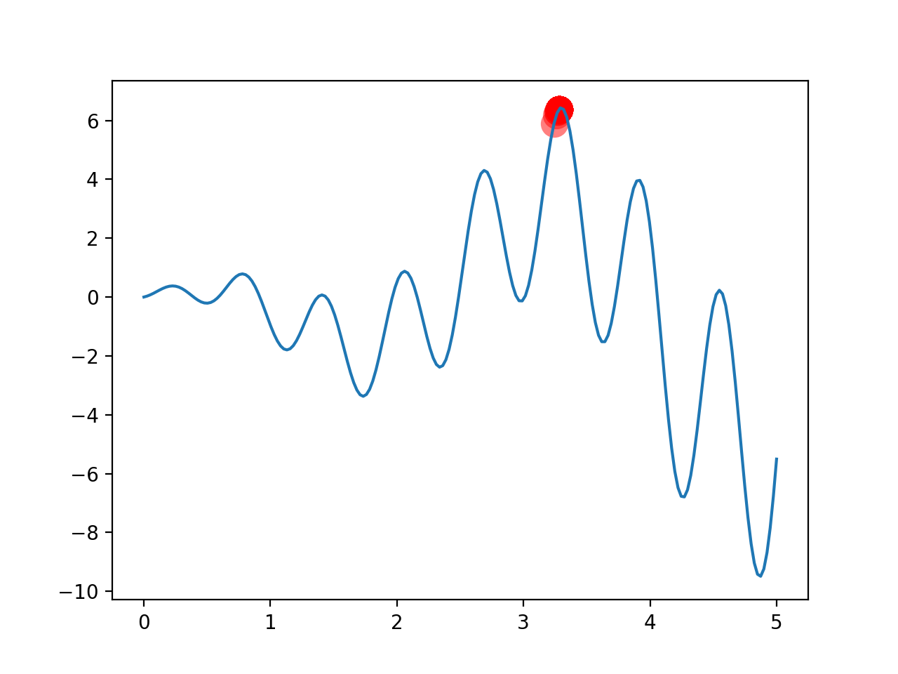
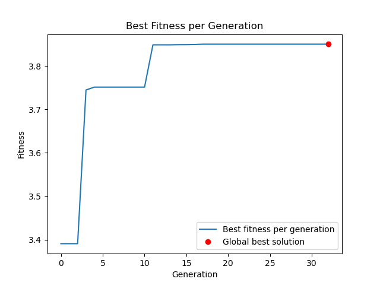

# 遗传算法（Genetic Algorithm，GA）

## 目录

- [GA算法原理](#GA算法原理)
- [常用术语](#常用术语)
- [遗传算法基本过程介绍](#遗传算法基本过程介绍)
- [遗传算法的步骤](#遗传算法的步骤)
  - [染色体编码](#染色体编码)
    - [编码](#编码)
    - [解码](#解码)
  - [初始群体的生成](#初始群体的生成)
  - [适应度值评估检测](#适应度值评估检测)
    - [线性尺度变换](#线性尺度变换)
    - [乘幂尺度变换](#乘幂尺度变换)
    - [指数尺度变换](#指数尺度变换)
  - [遗传算子](#遗传算子)
    - [选择](#选择)
    - [交叉](#交叉)
    - [变异](#变异)
  - [终止判断条件](#终止判断条件)
- [fitness方程](#fitness方程)
- [DNA 编码](#DNA-编码)
- [F(x)](#Fx)
- [进化](#进化)
- [完整代码](#完整代码)
- [最终结果](#最终结果)

遗传算法是进化算法的一个分支. 它将达尔文的进化理论搬进了计算机.

## **GA算法原理**

首先我们来介绍进化算法的先驱遗传算法，遗传算法（Genetic Algorithm，简称GA）是一种最基本的进化算法，它是模拟达尔文生物进化理论的一种优化模型，最早由J.Holland教授于1975年提出。**遗传算法中种群分每个个体都是解空间上的一个可行解，通过模拟生物的进化过程，进行遗传、变异、交叉、复制从而在解空间内搜索最优解。**

## 常用术语

由于遗传算法是由进化论和遗传学机理而产生的搜索算法，所以在这个算法中会用到一些生物遗传学知识，下面是我们将会用一些术语：

**① 染色体(Chromosome)：** 染色体又可称为基因型个体(individuals)，一定数量的个体组成了群体(population)，群体中个体的数量叫做群体大小（population size）。

**② 位串(Bit String)：** 个体的表示形式。对应于遗传学中的染色体。

**③ 基因(Gene)：**基因是染色体中的元素，用于表示个体的特征。例如**有一个串（即染色体）S=1011，则其中的1，0，1，1这4个元素分别称为基因**。

**④ 特征值( Feature)：** 在用串表示整数时，基因的特征值与二进制数的权一致；**例如在串 S=1011 中，基因位置3中的1，它的基因特征值为2；基因位置1中的1，它的基因特征值为8**。

**⑤ 适应度(Fitness)：各个个体对环境的适应程度叫做适应度(fitness)**。为了体现染色体的适应能力，引入了对问题中的每一个染色体都能进行度量的函数，叫适应度函数。这个函数通常会被**用来计算个体在群体中被使用的概率**。

**⑥ 基因型(Genotype)：**或称遗传型，是指基因组定义遗传特征和表现。对于于GA中的**位串**。

**⑦ 表现型(Phenotype)：**生物体的基因型在特定环境下的表现特征。对应于GA中的**位串解码后的参数**。

> 📌**用一句话概括遗传算法: “在程序里生宝宝, 杀死不乖的宝宝, 让乖宝宝继续生宝宝”.**

我们的 “乖宝宝” 就是图中更高的点, 用遗传算法, 我们就能轻松找到 “最乖的宝宝”.


## **遗传算法基本过程介绍**

基本遗传算法(也称标准遗传算法或简单遗传算法，Simple Genetic Algorithm，简称SGA)是一种**群体型操作**，该操作以群体中的所有个体为对象

只使用基本遗传算子(Genetic Operator)：

- **选择算子(Selection Operator)**
- **交叉算子(Crossover Operator)**
- **变异算子(Mutation Operator)**

其遗传进化操作过程简单，容易理解，是其它一些遗传算法的基础，它不仅给各种遗传算法提供了一个基本框架，同时也具有一定的应用价值。**选择**、**交叉**和**变异**是遗传算法的3个主要操作算子，它们**构成了遗传操作**，使遗传算法具有了其它方法没有的特点。

其表示方法如下：

$$
S G A=\left(C, E, P_{0}, M, \phi, \Gamma,  \psi, T\right)
$$

其中，

&#x20;$C$表示个体的编码方案

$E$ 表示个体适应度评价函数

$P_{0}$ 表示初始种群

$M$表示种群大小

$\phi$ 表示选择算子

$Γ$ 表示交叉算子

$\psi$表示变异算子

$T$ 表示遗传算法终止条件

## **遗传算法的步骤**

### 染色体编码

#### 编码

解空间中的解在遗传算法中的表示形式。从问题的解(solution)到基因型的映射称为编码，**即把一个问题的可行解从其解空间转换到遗传算法的搜索空间的转换方法**。遗传算法在进行搜索之前先将解空间的解表示成遗传算法的基因型串(也就是染色体)结构数据，这些串结构数据的不同组合就构成了不同的点。

常见的编码方法有**二进制编码**、**格雷码编码**、 **浮点数编码**、**各参数级联编码**、**多参数交叉编码**等。

二进制编码：即组成染色体的基因序列是由二进制数表示，具有编码解码简单易用，交叉变异易于程序实现等特点。

格雷编码：两个相邻的数用格雷码表示，其对应的码位只有一个不相同，从而可以提高算法的局部搜索能力。这是格雷码相比二进制码而言所具备的优势。

浮点数编码：是指将个体范围映射到对应浮点数区间范围，精度可以随浮点数区间大小而改变。

设某一参数的取值范围为 $\left[U_{1}, U_{2}\right]$，我们用长度为$k$的二进制编码符号来表示该参数，则它总共产生$2^{k}$种不同的编码，可使参数编码时的对应关系：

$$
\begin{array}{l}000000 \cdots 0000=0 \rightarrow U_{1} \\ 000000 \cdots 0001=1 \rightarrow U_{1}+\delta \\ 000000 \cdots 0010=2 \rightarrow U_{1}+2 \delta \\ \vdots \\ 111111 \cdots 1111=2^{k} \cdots 1^{k} \rightarrow U_{2} \end{array}
$$

其中，$\delta=\frac{U_{2}-U_{1}}{2^{k}-1}$

#### 解码

**遗传算法染色体向问题解的转换**。假设某一个体的编码，则对应的解码公式为

$$
X=U_{1}+\left(\sum_{i=1}^{k} b_{i} \cdot 2^{i-1}\right) \cdot \frac{U_{2}-U_{1}}{2^{k}-1}
$$

设有参数 $X \in[2,4]$，现用5位二进制编码对X进行编码，得 $2^{5}=32$个二进制串（染色体）

$$
\begin{array}{l}00000,00001,00010,00011,00100,00101,00110,00111 \\ 01000,01001,01010,01011,01100,01101,01110,01111 \\ 10000,10001,10010,10011,10100,10101,10110,10111 \\ 11000,11001,11010,11011,11100,11101,11110,11111\end{array}
$$

对于任一个二进制中，只要带入上面公式，就可以得到对应的解码，如 $x_{22}=10101$
它对应的十进制为

$$
\sum_{i=1}^{5} b_{i} \cdot 2^{i-1}=1+0 \times 2+1 \times 2^{2}+0 \times 2^{3}+1 \times 2^{4}=21
$$

则对应参数X的值为

$$
2+21 \times \frac{4-2}{2^{k}-1}=3.3548,
$$

### **初始群体的生成**

设置最大进化代数 $ T  $，群体大小 $ M  $，交叉概率 $P_{c}$ ，变异概率 $P_{m}$ ，随机生成 $ M  $个个体作为初始化群体$  P_{0} $ 。

### 适应度值评估检测

**适应度函数表明个体或解的优劣性**。对于不同的问题，适应度函数的定义方式不同。**根据具体问题，计算群体P(t)中各个个体的适应度**。

**适应度尺度变换****：** 一般来讲，是指算法迭代的不同阶段，能够通过适当改变个体的适应度大小，进而避免群体间适应度相当而造成的竞争减弱，导致种群收敛于局部最优解。

尺度变换选用的经典方法：**线性尺度变换**、**乘幂尺度变换**以及**指数尺度变换**。

#### 线性尺度变换

$$
F^{\prime}=a F+b
$$

是用一个线性函数表示，其中a为比例系数，b为平移系数，F为变换前适应度尺度，$F^{\prime}$为变换后适应度尺度。

#### 乘幂尺度变换

$$
F^{\prime}=F^{k}
$$

是将原适应度尺度F取k次幂。其中k为幂，F为转变前适应度尺度，$F^{\prime}$为转变后适应度尺度。

#### 指数尺度变换

$$
F^{\prime}=e^{-\beta F}
$$

是指首先将原尺度乘以一个$\beta$，然后取反，将作为自然数e的幂，其中$\beta$的大小决定了适应度尺度变换的强弱。

### **遗传算子**

遗传算法使用以下三种遗传算子：

#### 选择

**选择操作从旧群体中以一定概率选择优良个体组成新的种群，以繁殖得到下一代个体。** 个体被选中的概率跟适应度值有关，**个体适应度值越高，被选中的概率越大**。以轮盘赌法为例，若设种群数为 $M$ ，个体 $i$的适应度为 $f_{i}$，则个体i被选取的概率为：

$$
P_{i}=\frac{f_{i}}{\sum_{k=1}^{M} f_{k}}
$$

当个体选择的概率给定后，**产生\[0,1]之间均匀随机数来决定哪个个体参加交配**。若个体的选择概率大，则有机会被**多次选中**，那么它的遗传基因就会在种群中扩大；若个体的选择概率小，则被淘汰的可能性会大。

#### 交叉

**交叉操作是指从种群中随机选择两个个体，通过两个染色体的交换组合，把父串的优秀特征遗传给子串，从而产生新的优秀个体。**

在实际应用中，**使用率最高的是单点交叉算子**，该算子在配对的染色体中随机的选择一个交叉位置，然后在该交叉位置对配对的染色体进行基因位变换。

1. 对种群个体执行随机配对操作
2. 逐一对配对的染色体，随机设置一个位置交叉点
3. 依照设定的交叉概率P进行相互配对

注：其他交叉算子包括：

a)**双点交叉或多点交叉**，即对配对的染色体随机设置两个或者多个交叉点，然后进行交叉运算，改变染色体基因序列。

b)**均匀交叉**，即配对的染色体基因序列上的每个位置都以等概率进行交叉，以此组成新的基因序列。

c)**算术交叉**，是指配对染色体之间采用线性组合方式进行交叉，改变染色体基因序列。



#### 变异

为了防止遗传算法在优化过程中陷入局部最优解，在搜索过程中，需要对个体进行变异，**在实际应用中，主要采用单点变异，也叫****位变异****，即****只需要对基因序列中某一个位进行变异****，以二进制编码为例，即0变为1，而1变为0**。



群体 $P(t)$经过选择、交叉、变异运算后得到下一代群体$P(t+1)$
&#x20;

### **终止判断条件**

若 $t \leq T$，则 $t \leftarrow t+1$，转到步骤2；否则以进化过程中所得到的**具有最大适应度的个体作为最好的解输出**，终止运算。



从遗传算法运算流程可以看出，进化操作过程简单，容易理解，它给其它各种遗传算法提供了一个基本框架。

**需要注意的是：**

遗传算法有4个运行参数需要**预先设定**，即

$M$：种群大小

$T$：遗传算法的终止进化代数

$P_{c}$ ：交叉概率，一般为0.4\~0.99

$P_{m}$ ：变异概率，一般取0.001\~0.1

***

下面是遗传算法代码

首先设置了超参数

```python
import numpy as np
import matplotlib.pyplot as plt

DNA_SIZE = 10            # DNA length
POP_SIZE = 100           # population size
CROSS_RATE = 0.8         # mating probability (DNA crossover)
MUTATION_RATE = 0.003    # mutation probability
N_GENERATIONS = 200
X_BOUND = [0, 5]         # x upper and lower bounds
```

## fitness方程

在遗传算法中需要一个评估好坏的方程，这个方程通常被称为fitness，在下面的图形中越高的点，fitness越高



如果这个曲线上任一点的 y 值是 `pred` 的话, 我们的 fitness 就是下面这样:

```python
def get_fitness(pred):
    return pred
```

## DNA 编码

在 GA 中有基因, 为了方便, 我们直接就称为 `DNA` 吧. GA 中第二重要的就是这 `DNA` 了, 如何编码和解码 `DNA`, 就是你使用 GA 首先要想到的问题. 传统的 GA 中, `DNA` 我们能用一串二进制来表示, 比如:

```python
DNA1 = [1, 1, 0, 1, 0, 0, 1]
DNA2 = [1, 0, 1, 1, 0, 1, 1]
```

但是长成这样的 `DNA` 并不好使用. 如果要将它**解码**, 我们可以**将二进制转换成十进制**, 比如二进制的 `11` 就是十进制的 `3`. 这种转换的步骤在程序中很好执行. 但是有时候我们会需要精确到小数, 其实也很简单, 只要再将十进制的数浓缩一下就好. **比如我有 ****`1111`**** 这么长的 ****`DNA`****, 我们产生的十进制数范围是 \[0, 15], 而我需要的范围是 \[-1, 1], 我们就将 \[0, 15] 缩放到 \[-1, 1] 这个范围就好.**

```python
def translateDNA(pop):
    return pop.dot(2 ** np.arange(DNA_SIZE)[::-1]) / float(2**DNA_SIZE-1) * X_BOUND[1]
```

注意, 这里的 `pop` 是一个储存二进制 `DNA` 的矩阵, 他的 shape 是这样 (pop\_size, DNA\_size).

1. `2 ** np.arange(DNA_SIZE)[::-1]`：生成一个长度为DNA\_SIZE的数组，其中每个元素为2的幂次方，幂次从0到DNA\_SIZE-1。
2. `pop.dot(2 ** np.arange(DNA_SIZE)[::-1])`：将输入的DNA序列(pop)转换为对应的十进制数值。通过点积运算(dot)，将DNA序列与上面生成的幂次数组相乘，并将结果进行求和，**得到DNA序列对应的十进制数值**。
3. `/ float(2**DNA_SIZE-1)`：将十进制数值缩放到\[0,1]之间的实数范围内。使用2的DNA\_SIZE次幂减1，**将十进制数值映射到\[0, 2^DNA\_SIZE - 1]的整数范围内**，然后除以该范围的**最大值来将其缩放到\[0,1]之间**。
4. `* X_BOUND[1]`：将实数范围缩放到指定的范围\[X\_BOUND\[0], X\_BOUND\[1]]内。将\[0, 1]之间的实数范围缩放到\[X\_BOUND\[0], X\_BOUND\[1]]之间的指定范围内，其中\*\*X\_BOUND是一个二元组，表示实数范围的上限和下限。\*\*因此，该函数的输出是一个形状为(pop\_size,)的一维数组，其中包含了输入中每个二进制DNA序列所代表的实数值。

## F(x)

```python
# 适应度函数
def fitness_function(x):
    # 计算目标函数值
    y = x * np.sin(10 * math.pi * x) + 2.0
    # 返回适应度（即目标函数值）
    return y


# 适应度分数
def compute_fitness(decimal_population):
    fitness_values = []
    # 遍历每一个十进制数，计算适应度值并添加到适应度值列表中
    for decimal in decimal_population:
        # 调用适应度函数，计算适应度值
        y = fitness_function(decimal)
        # 将适应度值添加到适应度值列表中
        fitness_values.append(y)
    # 返回适应度值列表
    return fitness_values
```

这段Python代码实现了一个遗传算法(Genetic Algorithm)中使用的适应度函数。适应度函数是遗传算法的核心，它用于对每个个体进行评估，以确定其适应度值。该适应度函数的表达式为y = x \* sin(10 \* pi \* x) + 2.0。

在适应度函数中，输入参数x是一个十进制数，该函数计算并返回这个十进制数对应的适应度值y。具体的计算方式是将x乘以sin(10 \* pi \* x)，然后加上常数2.0。其中，sin函数的参数是10倍的pi与x的乘积。

接下来，在compute\_fitness函数中，首先定义了一个空列表fitness\_values，在遍历输入的decimal\_population列表中的每一个十进制数时，调用适应度函数来计算该十进制数对应的适应度值，并将这些适应度值添加到fitness\_values列表中。最后，该函数返回这个适应度值列表。

总之，这段Python代码实现了一个简单的适应度函数及其计算过程，可以用于优化问题中的目标函数，例如求解最大化或最小化问题。

## 进化

进化分三步:

- 适者生存 (selection)
- DNA 交叉配对 (crossover)
- DNA 变异 (mutation)

我们用 python 的三个功能, 一个循环表示:

```python
# 初始化种群
def generate_initial_population(population_size, num_bits):
    population = []
    for i in range(population_size):
        temporary = []
        # 染色体暂存器
        for j in range(num_bits):
            temporary.append(random.choice([0, 1]))
            # 随机选择一个值，可以是0或1，将其添加到染色体中
        population.append(temporary)
        # 将染色体添加到种群中
    return population
```

这段Python代码实现了一个用于创建初始种群(population)的函数generate\_initial\_population。在遗传算法中，种群是由一组个体组成的集合，每个个体都有自己的染色体(chromosome)，染色体由基因(gene)组成。

具体来说，generate\_initial\_population函数接收两个参数：population\_size和num\_bits。其中，population\_size是指生成的种群数量，而num\_bits则表示每个染色体所包含的基因数量。

在函数内部，通过使用for循环迭代population\_size次，在每次迭代中生成一个新的染色体。具体地，对于每个染色体，首先定义一个空列表temporary，用于暂存生成的基因序列。然后，使用第二个for循环迭代num\_bits次，在每次迭代中随机选择0或1，并将这个值添加到temporary列表中。最后，将temporary列表作为一个染色体添加到种群population列表中。

最终，该函数返回生成的种群population作为输出结果。这个种群可以被用于执行后续的遗传算法操作，例如交叉(crossover)和变异(mutation)。

适者生存的 `select()` 很简单, 我们只要按照适应程度 `fitness` 来选 `pop` 中的 `parent` 就好. `fitness` 越大, 越有可能被选到.

```python
# 选择操作
def selection(population, fitness_values, num_parents):
    # 保留适应度非负的个体,where返回的是一个二维数组
    positive_fitness_indices = np.where(np.array(fitness_values) >= 0)[0]
    # 根据下标找出个体和他的适应度值
    population = [population[i] for i in positive_fitness_indices]
    fitness_values = [fitness_values[i] for i in positive_fitness_indices]

    # 计算适应度总和
    fitness_sum = sum(fitness_values)

    # 计算每个个体的选择概率，与适应度分数成正比
    probabilities = [fitness_value / fitness_sum for fitness_value in fitness_values]

    # 计算累积概率分布
    cumulative_probabilities = np.cumsum(probabilities)

    # 选择父代个体
    parents = []
    for i in range(num_parents):
        # 产生一个0到1之间的随机数
        rand_num = np.random.uniform(low=0, high=1.0)
        # 确定随机数出现在哪个个体的概率区域内
        for j in range(len(cumulative_probabilities)):
            # 当前随机数小于等于累积概率列表中的某个元素，就选择该元素对应的个体作为父代
            if rand_num <= cumulative_probabilities[j]:
                parents.append(population[j])  # 直接返回基因
                break

    return parents
```

该Python代码实现了遗传算法中的选择操作(selection)，用于从当前种群中选择出一部分个体作为下一代的父代(parents)。

首先，该函数根据适应度值是否非负来保留种群中的个体。如果个体的适应度为负数，则应该从种群中删除这些个体，以便更好地提高种群整体的适应度。这里使用np.where函数和数组索引来实现此操作。

然后，计算种群中每个个体被选择为父代的概率。具体来说，将每个个体的适应度值除以总适应度值之和，得到每个个体被选择的概率(probabilities)。这里使用了Python列表推导式来实现此操作。

接下来，根据这些概率值计算累积概率分布(cumulative\_probabilities)，以确定每个个体被选择为父代的概率区域。

最后，使用for循环迭代num\_parents次，在每次迭代中生成一个0到1之间的随机数(rand\_num)，并根据这个随机数选择一个父代个体。具体来说，对于每个随机数，使用另一个for循环遍历cumulative\_probabilities列表，找到第一个小于等于随机数的概率值，然后返回该概率值对应的个体(即父代)。最终，该函数返回选定的所有父代个体作为输出结果。

总之，这个选择操作是遗传算法中一个关键的步骤，用于从种群中选择适应度高的个体，并将它们作为进化过程中下一代的父代。

接下来进行交叉配对. 方式很简单. 比如这两个 DNA, `Y` 的点我们取 `DNA1` 中的元素, `N` 的点取 `DNA2` 中的. 生成的 `DNA3` 就有来自父母的基因了.

```python
DNA1 = [1, 1, 0, 1, 0, 0, 1]
       [Y, N, Y, N, N, Y, N]
DNA2 = [1, 0, 1, 1, 0, 1, 1]

DNA3 = [1, 0, 0, 1, 0, 0, 1]
```

在这里我们使用的是单点交叉

```python
# 单点交叉操作
def single_point_crossover(parents, crossover_rate):
    offspring = []  # 初始化后代列表
    num_parents = len(parents)  # 父代数量
    num_bits = len(parents[0])  # 每个父代的二进制编码位数

    # 对每两个相邻的父代进行交叉操作
    for i in range(0, num_parents - 1, 2):
        parent1 = parents[i]  # 第一个父代
        parent2 = parents[i + 1]  # 第二个父代

        # 随机生成交叉点
        crossover_point = np.random.randint(1, num_bits)

        # 根据交叉率进行交叉操作
        if np.random.random() < crossover_rate:
            # 生成新的后代
            offspring1 = parent1[:crossover_point] + parent2[crossover_point:]
            offspring2 = parent2[:crossover_point] + parent1[crossover_point:]
        else:
            # 如果不交叉，则直接将父代作为后代
            offspring1 = parent1
            offspring2 = parent2

        # 将后代添加到列表中
        offspring.append(offspring1)
        offspring.append(offspring2)

    return offspring  # 返回生成的后代列表
```

该Python代码实现了遗传算法中的单点交叉(single-point crossover)操作，用于从父代个体中生成新一代后代(offspring)。

首先，该函数确定父代的数量(num\_parents)和每个父代的二进制编码位数(num\_bits)。然后，使用for循环迭代父代列表中每两个相邻的父代进行交叉操作。

对于每一对父代(parent1和parent2)，随机选择一个交叉点(crossover\_point)。这里使用numpy.random.randint函数来生成一个介于1和num\_bits之间的随机整数值。

接下来，根据交叉率(crossover\_rate)确定是否进行交叉操作。如果需要进行交叉，则将交叉点前面的基因序列从第一个父代中取出，将交叉点后面的基因序列从第二个父代中取出，并将它们组合起来形成一个新的后代(offspring1)。同时，也可以采用类似的方式从第二个父代中获取相应基因序列，以生成另一个新的后代(offspring2)。如果不需要进行交叉，则直接将父代作为后代。

最后，将生成的后代添加到offspring列表中，并返回这个列表作为输出结果。

总之，这个单点交叉操作是遗传算法中非常常见的一种交叉方式，它通过随机选择一个位置，在父代个体中交换基因序列，以生成新一代的后代。

mutation 就更好写了, 将某些 DNA 中的 `0` 变成 `1`, `1` 变成 `0`.

```python
# 变异操作
def mutation(offspring, mutation_rate):
    # 遍历每个后代
    for i in range(len(offspring)):
        # 遍历每个后代的基因
        for j in range(len(offspring[i])):
            # 判断是否进行变异操作
            if np.random.uniform(0, 1) <= mutation_rate:
                # 随机将基因进行变异
                offspring[i][j] = 1 - offspring[i][j]
    # 返回变异后的后代
    return offspring
```

该Python代码实现了遗传算法中的变异(mutation)操作，用于在后代个体中随机地修改一些基因。

对于每个后代(offspring)，使用两个for循环遍历其所有基因。对于每个基因，使用numpy.random.uniform函数生成一个介于0和1之间的随机数，并与给定的变异率(mutation\_rate)进行比较。如果随机数小于变异率，则将该基因的值翻转(0变成1, 1变成0)，以进行变异操作。

最终，该函数返回经过变异操作后的新一代后代列表(offspring)。

总之，变异操作是遗传算法中的一个重要步骤，它通过随机选择一些基因来增加种群的多样性，从而提高整体适应度并防止陷入局部最优解。

## 完整代码

```python
import random
import math
import matplotlib.pyplot as plt
import numpy as np
import copy

population_size = 25  # 种群数量
num_generations = 100  # 迭代次数
num_parents = 20  # 父代数量
num_bits = 20  # 每个个体包含的基因数量
crossover_rate = 0.9  # 交叉率
mutation_rate = 0.1  # 变异率
bounds = np.array([-1, 2])  # 搜索空间边界，即每个基因x的取值范围为[-5, 5]


# 初始化种群
def generate_initial_population(population_size, num_bits):
    population = []
    for i in range(population_size):
        temporary = []
        # 染色体暂存器
        for j in range(num_bits):
            temporary.append(random.choice([0, 1]))
            # 随机选择一个值，可以是0或1，将其添加到染色体中
        population.append(temporary)
        # 将染色体添加到种群中
    return population


# 从二进制编码转换为十进制数值
def binary_to_decimal(population, bounds):
    decimal_population = []  # 存储所有染色体的十进制数值
    for chromosome in population:  # 遍历种群中的每个染色体
        decimal = 0  # 初始化十进制数值
        for i, gene in enumerate(chromosome):  # 遍历染色体中的每个基因
            decimal += gene * (2 ** i)  # 将基因的值乘以2的幂次方，求和得到十进制数值
        lower_bound, upper_bound = bounds[0], bounds[1]
        mapped_decimal = lower_bound + (decimal / ((2 ** len(chromosome)) - 1)) * (upper_bound - lower_bound)
        decimal_population.append(mapped_decimal)  # 将映射后的十进制数值添加到列表中
    return decimal_population  # 返回所有染色体映射后的十进制数值列表


'''
1.用 (decimal_value - min_bound) 计算该值在范围内的位置
2.将该位置除以 (max_bound - min_bound)，得到一个比例，表示该位置在范围内所占比例
3.乘以 (2 ** num_bits - 1) 得到一个整数范围内的位置
4.用 int() 函数将该位置转换为整数
'''


# 十进制数值转换为二进制编码
def decimal_to_binary(decimal_value, num_bits, bounds):
    # 将十进制数值映射到整数范围
    min_bound, max_bound = bounds
    fixed_point_value = int((decimal_value - min_bound) / (max_bound - min_bound) * (2 ** num_bits - 1))

    # 将整数转换为二进制编码列表
    # format() 函数将整数转换为二进制字符串，并指定了字符串的位数
    binary_value = [int(bit) for bit in format(fixed_point_value, f'0{num_bits}b')]

    return binary_value


# 适应度函数
def fitness_function(x):
    # 计算目标函数值
    y = x * np.sin(10 * math.pi * x) + 2.0
    # 返回适应度（即目标函数值）
    return y


# 适应度分数
def compute_fitness(decimal_population):
    fitness_values = []
    # 遍历每一个十进制数，计算适应度值并添加到适应度值列表中
    for decimal in decimal_population:
        # 调用适应度函数，计算适应度值
        y = fitness_function(decimal)
        # 将适应度值添加到适应度值列表中
        fitness_values.append(y)
    # 返回适应度值列表
    return fitness_values


# 选择操作
def selection(population, fitness_values, num_parents):
    # 保留适应度非负的个体,where返回的是一个二维数组
    positive_fitness_indices = np.where(np.array(fitness_values) >= 0)[0]
    # 根据下标找出个体和他的适应度值
    population = [population[i] for i in positive_fitness_indices]
    fitness_values = [fitness_values[i] for i in positive_fitness_indices]

    # 计算适应度总和
    fitness_sum = sum(fitness_values)

    # 计算每个个体的选择概率，与适应度分数成正比
    probabilities = [fitness_value / fitness_sum for fitness_value in fitness_values]

    # 计算累积概率分布
    cumulative_probabilities = np.cumsum(probabilities)

    # 选择父代个体
    parents = []
    for i in range(num_parents):
        # 产生一个0到1之间的随机数
        rand_num = np.random.uniform(low=0, high=1.0)
        # 确定随机数出现在哪个个体的概率区域内
        for j in range(len(cumulative_probabilities)):
            # 当前随机数小于等于累积概率列表中的某个元素，就选择该元素对应的个体作为父代
            if rand_num <= cumulative_probabilities[j]:
                parents.append(population[j])  # 直接返回基因
                break

    return parents


# 单点交叉操作
def single_point_crossover(parents, crossover_rate):
    offspring = []  # 初始化后代列表
    num_parents = len(parents)  # 父代数量
    num_bits = len(parents[0])  # 每个父代的二进制编码位数

    # 对每两个相邻的父代进行交叉操作
    for i in range(0, num_parents - 1, 2):
        parent1 = parents[i]  # 第一个父代
        parent2 = parents[i + 1]  # 第二个父代

        # 随机生成交叉点
        crossover_point = np.random.randint(1, num_bits)

        # 根据交叉率进行交叉操作
        if np.random.random() < crossover_rate:
            # 生成新的后代
            offspring1 = parent1[:crossover_point] + parent2[crossover_point:]
            offspring2 = parent2[:crossover_point] + parent1[crossover_point:]
        else:
            # 如果不交叉，则直接将父代作为后代
            offspring1 = parent1
            offspring2 = parent2

        # 将后代添加到列表中
        offspring.append(offspring1)
        offspring.append(offspring2)

    return offspring  # 返回生成的后代列表


# 变异操作
def mutation(offspring, mutation_rate):
    # 遍历每个后代
    for i in range(len(offspring)):
        # 遍历每个后代的基因
        for j in range(len(offspring[i])):
            # 判断是否进行变异操作
            if np.random.uniform(0, 1) <= mutation_rate:
                # 随机将基因进行变异
                offspring[i][j] = 1 - offspring[i][j]
    # 返回变异后的后代
    return offspring


if __name__ == '__main__':
    # 初始化种群
    population = generate_initial_population(population_size, num_bits)
    # 迭代num_generations轮
    best_fitness = float('-inf')
    best_individual = None
    best_fitnesses = []
    for generation in range(num_generations):
        # 二进制转换为十进制
        decimal_population = binary_to_decimal(population, bounds)
        # 计算适应度分数
        fitness_values = compute_fitness(decimal_population)
        # 将当前种群深度拷贝一份用于下一代操作，避免直接修改当前种群
        next_generation = copy.deepcopy(population)
        # print('next_generation:', next_generation)
        # 选择父代个体
        parents = selection(population, fitness_values, num_parents)
        # 交叉操作
        offspring = single_point_crossover(parents, crossover_rate)
        # 变异操作
        offspring = mutation(offspring, mutation_rate)
        # 得到新的种群
        population = offspring
        # print('population:', population)

        # 找到当前一代中的最大适应度值的下标
        max_fitness_index = 0
        for i in range(1, len(fitness_values)):
            if fitness_values[i] > fitness_values[max_fitness_index]:
                max_fitness_index = i

        # 记录每一代的最好的适应度和个体
        # 适应度分数
        generation_best_fitness = fitness_values[max_fitness_index]
        # print('generation_best_fitness:',generation_best_fitness)
        # 适应度个体（十进制）
        generation_best_individual = decimal_population[max_fitness_index]
        # print('generation_best_individual:', generation_best_individual)
        best_fitnesses.append(generation_best_fitness)

        # 将每一代最好的适应度和个体放入原始种群
        population[0] = next_generation[max_fitness_index]

        # 输出最佳个体的二进制编码和映射后的十进制值
        best_individual_binary = decimal_to_binary(generation_best_individual, num_bits, bounds)
        print(
            f"Generation {generation + 1} - Best fitness: {generation_best_fitness:.6f}, Best individual - Binary: {best_individual_binary}, Decimal: {generation_best_individual:.6f}")

        # 更新全局最优解
        if generation_best_fitness > best_fitness:
            best_fitness = generation_best_fitness
            best_individual = generation_best_individual

            # 如果找到了Best fitness大于 3.85027，就退出循环
            if generation_best_fitness > 3.85027:
                print(f"Solution found after {generation + 1} generations.")
                break

    # 将最佳个体的十进制值转换为二进制编码并输出
    best_individual_decimal = best_individual
    best_individual_binary = decimal_to_binary(best_individual_decimal, num_bits, bounds)

    print(
        f"\nFinal result - Best fitness: {best_fitness:.6f}, Best individual (decimal): {best_individual_decimal:.6f}, Best individual (binary): {best_individual_binary}")

    # 绘制每次迭代的最佳适应度
    plt.plot(best_fitnesses, label='Best fitness per generation')
    plt.xlabel('Generation')
    plt.ylabel('Fitness')
    plt.title('Best Fitness per Generation')

    # 标记全局最优解
    best_generation = best_fitnesses.index(best_fitness)
    plt.plot(best_generation, best_fitness, 'ro', label='Global best solution')

    # 显示图例和图形
    plt.legend()
    plt.show()
```

## 最终结果


